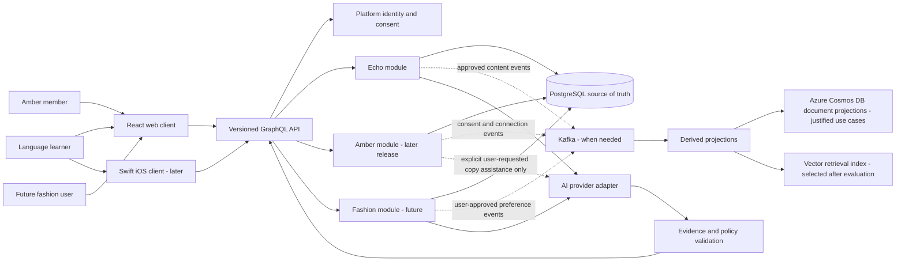
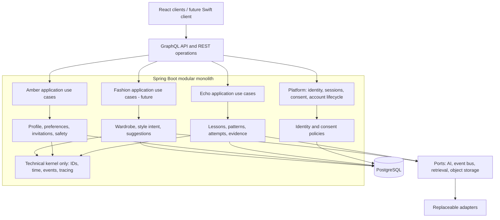
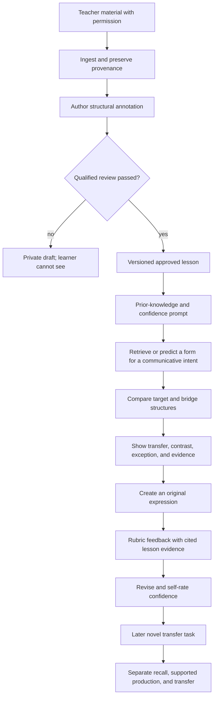
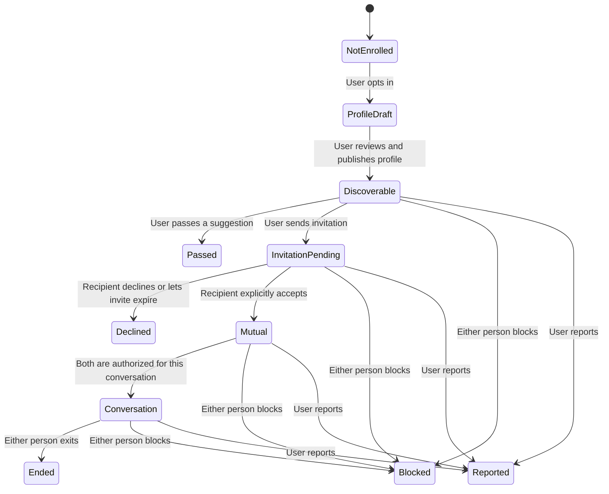
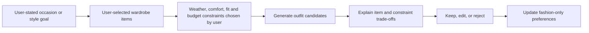
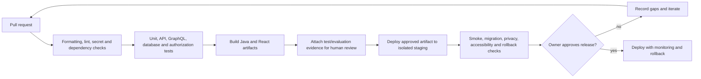

# Deepwater target architecture

**Status:** proposed architecture for review  
**Decision:** start with a modular monolith; keep product domains isolated; add
distributed infrastructure only when a measured requirement justifies it.

> See [the materials-based proposal](../product/DEEPWATER_MATERIALS_BASED_PROPOSAL.md)
> for the integrated product scope, adaptive Echo design, acceptance criteria,
> diagrams, and delivery roadmap grounded in the supplied lessons.

## 1. Architecture principles

1. Echo, Amber, and future AI fashion are product modules in one Deepwater family.
   A shared account is not shared permission to read data.
2. Each module owns its business rules, APIs, records, and lifecycle. No module
   imports another product's domain types.
3. PostgreSQL is the transactional source of truth. Kafka is for asynchronous,
   versioned domain events when reliable consumers are needed. Azure Cosmos DB or a
   vector index is a derived/read model behind an adapter, not a second authority.
4. AI can extract, compare, explain, or draft within an authorized context. Domain
   code validates output, source provenance, consent, and policy before anything
   is stored or shown.
5. Every cross-product data use is opt-in, minimal, explainable, revocable, and
   testable. Echo lesson content is not Amber matchmaking data.
6. Begin with a modular Spring Boot application and clear module interfaces.
   Extract a service only for a demonstrated scaling, availability, team ownership,
   or security-isolation need.

## 2. System context



Dashed paths are asynchronous or later-stage capabilities, not a claim about the
current local implementation. Amber user data should not be sent to a model for
matching in the initial release; deterministic explicit-preference rules are
easier to audit.

## 3. Deployable modules and boundaries



The technical kernel must not contain product concepts such as a language level,
dating compatibility, body measurements, lesson feedback, or outfit ranking.
Shared code stays small and boring. The method loop in the product document is a
design pattern; it does not require a single cross-product `PersonScore` or a
shared vector of human attributes.

### Suggested package/module ownership

```text
platform/
  identity/        account, session, authentication, account deletion
  consent/         purpose-specific grants and revocations
  audit/           security and policy state changes
echo/
  content/         lesson, examples, source provenance, review/version
  analysis/        structural annotations and comparison relations
  learning/        prompts, responses, rubric evidence, delayed transfer
amber/              separate release; explicit profile, intent, invitation, safety
fashion/            future; wardrobe and style domain isolated from other products
integration/
  graphql/         API schema and product-specific resolver packages
  events/          versioned envelopes, outbox/inbox and consumers
  ai/              provider ports, schemas, validation and evaluation
```

Each module should expose application use cases, not repositories or entities, to
other modules. Schema ownership can be enforced with PostgreSQL schemas or table
ownership and migration checks even while the code is one deployable.

## 4. Analytical core: shared interaction protocol, separate policies


The shared protocol can be implemented as small interfaces (`Intent`, `Evidence` ,
`Candidate`, `Explanation`, `UserChoice`, `Feedback`) only after Echo proves a
stable use case. Product-specific algorithms own feature definitions, objective
functions, thresholds, evaluation data, and deletion behavior. There is no
cross-product learning until a user grants a named purpose and a review approves
the design.

### Echo algorithm boundary



Authoring pipeline recommendation: parsers and AI can propose structure; they
cannot approve language facts. Store source passages only to the extent permitted.
For every comparison, state the relation (same function, similar form, partial
transfer, contrast, or no supported comparison); do not collapse it to a numeric
language-similarity score.

### Amber algorithm boundary



For MVP, compatibility is a transparent conjunction/weighted rule over explicit,
user-editable preferences only. A suggestion explains its qualifying signals. A
pass is not a training label for attraction; decline, block, and report must not
increase exposure or produce a hidden penalty. The mutual acceptance transition
is the only path to private conversation authorization.

### Future AI fashion boundary



Images, measurements, body descriptions, and wardrobe data are sensitive product
data. They require specific consent, retention, access, and deletion contracts.
They are never inferred from Echo or Amber data.

## 5. Data and event flow

PostgreSQL stores authoritative accounts, consent grants, lesson/version data,
practice evidence, and (when Amber is released) Amber profiles/invitations. Store
consent with purpose, scope, timestamp, notice/version, and revocation state.

When asynchronous work is justified:

1. Write the aggregate change and an outbox record in one PostgreSQL transaction.
2. Publish a versioned event from the outbox to Kafka with idempotent event ID,
   aggregate ID, schema version, and no unnecessary message or lesson body.
3. A consumer updates a product-scoped projection; it records processed event IDs.
4. Deletion/consent-revocation events invalidate derived records and retrieval
   indexes. Reconciliation jobs verify that deletion completed.

Do not dual-write directly to PostgreSQL and Kafka. Do not use Cosmos DB or a vector
store as the authority for consent or transactional state. Add Azure Cosmos only
when a document/read-projection requirement is measured; add a vector store only
after retrieval quality and privacy filters are evaluated against a baseline.

## 6. API and clients

- React web client for the first vertical slice.
- Swift iOS client later, using the same versioned API and product permissions.
- Spring Boot GraphQL for product queries/mutations; REST for health, authentication
  where appropriate, webhooks, and operational endpoints.
- Every mutation carries authenticated subject and product-purpose context. Object
  identifiers are never treated as authorization.
- GraphQL query depth/complexity, input limits, rate limits, and field-level
  authorization are release controls, not future polish.
- API errors are stable, non-sensitive, and tested for both authenticated and
  unauthenticated calls; expected authorization failures must not become HTTP 500.

## 7. AI and retrieval controls

AI access is through backend ports. Requests include only the minimum authorized
context. Keep provider secrets on the server. Validate structured output against
schemas and domain constraints. Retain provider/model/prompt-policy version,
source IDs, and reviewer state for published lesson content. Allow abstention.

Retrieval must filter by product, owner/access purpose, source approval, and
deletion/version state before returning context to a model. Never retrieve Amber
messages or Echo learner answers into a different product by default. Use a
deterministic non-AI path when no safe/approved evidence exists.

## 8. Non-functional architecture requirements

Initial measurable targets should be agreed for the first pilot. Proposed testable
starting targets (adjust after deployment evidence):

- At least 99% of reviewed-content API requests succeed during a pilot's published
  availability window, excluding planned maintenance.
- p95 lesson content and profile reads below 500 ms at an agreed pilot load; AI
  generation is measured separately and never blocks a safe deterministic path.
- Every protected mutation has tests for no token, expired token, wrong owner,
  revoked consent, and valid owner.
- No raw passwords, bearer tokens, lesson response bodies, or private Amber message
  bodies in logs or analytics.
- Automated database backup restore test before any public pilot; measured RPO/RTO
  targets selected by the product owner.
- WCAG 2.2 AA review for learner and connection-critical web flows before launch.
- All event consumers are idempotent and have replay/dead-letter procedures before
  Kafka is enabled for production state.

These are proposed gates, not assertions that the present demo already satisfies
them. See the product acceptance document for user-visible criteria and metrics.

## 9. Environment and delivery sequence



The local H2 profile is for development and automated tests only. CI must use
PostgreSQL for persistence integration tests. Add Azure infrastructure, Kafka,
Cosmos projections, Kubernetes, and deployment workflows in separately reviewed
steps after a local vertical slice and operational requirements are stable. Never
deploy just because the CI build is green.

## 10. Current implementation versus target

The current repository contains a small local proof of flow: account registration,
two seeded comparison cases, persisted practice, Amber profile creation, sample
profiles, and invitation acceptance. It uses H2 locally. Its GraphQL auth error
path has a known HTTP 500 test failure. It does not yet implement the content
authoring/review model, the analytical Echo algorithm, Kafka delivery, Cosmos,
vector retrieval, Amber block/report/moderation, Swift, Kubernetes, or deployment.

Treat `STATUS.md` as the dated implementation ledger, this file as the proposed
technical target, and
[`DEEPWATER_PRODUCT_SCOPE_AND_ACCEPTANCE.md`](../product/DEEPWATER_PRODUCT_SCOPE_AND_ACCEPTANCE.md)
as the product contract. Update all three when a decision changes.
