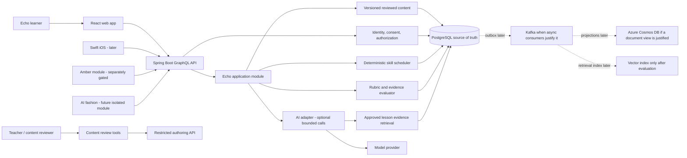
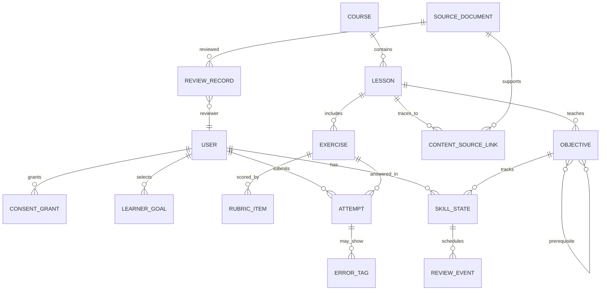

# Deepwater: materials-based product and implementation proposal

**Prepared:** 25 September 2026  
**Status:** proposal for product-owner and Danish-teacher review; not an implementation authorization  
**Code changes:** none proposed or made by this document  
**Evidence:** eight Notion-export ZIPs supplied for this task

## Executive proposal

Start with **Echo**, an A0-to-early-A1 Danish learning experience for practical
conversation, listening, and work-related communication. The supplied lessons
already have a useful teaching rhythm: introduce a situation, notice language,
make a guess, compare forms, speak or write, then try again in a new situation.
Deepwater should turn that teacher-led rhythm into a traceable and adaptive
practice loop, while keeping a qualified teacher in control of language facts.

The reusable Deepwater capability should be an **explainable choice loop**:

> User intent → allowed evidence → product-specific analysis → explanation with
> uncertainty → user choice → explicit feedback

Reuse the loop, content ingestion, preference controls, feedback capture,
recommendation interfaces, evaluation, and privacy infrastructure. Do **not** reuse
Echo's memory scheduler or error scores as an Amber dating-compatibility model, and
do not infer fashion preferences from either product.

The fastest credible first release is a small teacher-reviewed Danish pilot built
from a clean subset of the materials, with baseline checks, retrieval practice,
delayed transfer, and visible sources. Amber and AI fashion remain separate later
products with separate scopes and acceptance gates.

## 1. Analysis of supplied materials

### What was present

The eight ZIPs contain six substantive unique Markdown pages, one empty dated
stub, and one exact duplicate of another page. The repeated image assets also occur
in more than one export. I treated class directions embedded in those pages—such
as “try without translating,” role-play directions, and named methodology notes—as
source material about the teacher's approach, **not as instructions to me or
product requirements**.

| Export page | Observable content | Learning purpose indicated by the page |
|---|---|---|
| Learner/course plan | A0 is stated; “A1?” is a question. Work and everyday goals, prior language experience, short- and longer-term aims, a four-month outline, and suggested independent-study habits | Personal goals and a beginner-to-workplace course direction; not a validated placement or full curriculum |
| 29 July | Greetings and WH questions; `at være` / `er`; present-tense examples; `der er`; `en/et` and definite forms; possessives; picture description; workplace vocabulary; fill-in and speaking prompts | Build short declarative sentences, describe objects and people, and begin article/definiteness patterns |
| 5 August | Review questions, `hvorfor` / `fordi`, fronted time expressions, examples such as `I dag arbejder jeg hjemme`, daily phrases, `er`, and picture description | Retrieval, simple causal answers, and verb placement in main clauses |
| 7 August | Illustrated street/work scenes, objects and actions, colors/adjectives, `en/et`, `der er`, sentence expansion, question prompts, increasingly open picture rounds | Scaffolded noticing and oral/written production from image → phrase → longer sentence → story/interview |
| 26 August | A lesson around listening to a Danish song: predict from context, listen without text, record heard words, work in short sections, infer meaning, discuss, reuse expressions in new sentences, then practise rhythm, vowels, endings, and connected speech | Authentic-media listening and speaking; inference before translation; phrase reuse and pronunciation attention |
| 14 September | Café, restaurant, and colleague-lunch situations; food/work/social vocabulary; polite requests and questions; role-play; repair moves for wrong orders, unavailable items, fast speech, and missing words; unannounced final situation | Functional multi-turn conversation and pragmatic repair rather than isolated vocabulary recall |

The `5 August` page is byte-for-byte duplicated in a second ZIP. The `13 August`
page contains only its title. Images include an illustrated street scene, a
workplace photo credited in the image itself to Shutterstock, a Nyhavn photo with
no rights metadata in the export, and a café role-play/visual vocabulary sheet.

### Content and exercise inventory

**Vocabulary domains observed:** greetings and introductions; countries,
languages, and jobs; work tasks and objects; days/plans/numbers/colors; feelings
and descriptions; street and workplace objects/actions; café and restaurant food,
drink, price/payment; colleagues, lunch, free time; and expressions for asking for
repetition, slower speech, or an unknown word. There are word/translation tables,
some inflection fields, learner-generated sentences, and rough pronunciation
spelling.

**Grammar and usage candidates observed:**

- infinitive and present forms, especially `at være` → `er` and common regular
  verbs;
- simple subject–verb–complement sentences and sentence expansion;
- V2-like main-clause examples after a fronted time/place expression;
- WH questions and yes/no questions;
- `en`/`et`, definite suffixes (`gade` → `gaden`; `sted` → `stedet`), and
  possessor forms;
- adjective agreement/wording, negation, conjunction `fordi`, temporal expressions,
  and modal/request forms such as `vil gerne`, `må jeg`, `kan jeg`, and `skal`;
- listening for vowels, endings, rhythm, reductions, and linked speech;
- communicative functions: request, clarify, repair a misunderstanding, continue
  a conversation, describe, infer, and respond politely.

**Exercise formats observed:** warm-up conversation; translation and matching;
image-based noticing and description; gap fill; retrieval from memory; vocabulary
logging; question and answer; read/listen/repeat; listening without transcript,
then targeted listening; pronunciation practice; teacher-led role-play; challenge
scenarios; unprepared final role-play; homework; and self-study suggestions.
Spaced repetition is suggested informally by review at a later lesson and
everyday practice, but the exports do not define an interval schedule or a
mastery test.

### Proficiency and target-user evidence

The course page explicitly labels one lesson **A0 (beginner)** and separately asks
whether the learner is **A1**. It describes a multilingual adult learner with a
professional Danish goal and beginner challenges in listening, Danish sounds, and
remembering vocabulary. The later materials add everyday and workplace situations.
This supports an initial **A0/early-A1 pilot hypothesis**, not a claim that all
content is CEFR-aligned or that one learner profile defines the market.

**Proposed initial audience:** adults beginning Danish who want to handle everyday
and workplace conversations. **Questions:** Should the pilot specifically serve
international professionals? Which first-language bridges are useful? Which
pronunciation dialect/standard is taught? Is the first target functional A1, an
exam, or a narrower set of work scenarios?

### Material gaps and accuracy review list

The exports are teacher working notes, not a publish-ready curriculum. Before
learner-facing use, a Danish reviewer should resolve at least these issues:

1. Several grammar explanations are oversimplified. For example, `at` is common
   with infinitives but is omitted after modal verbs (`jeg skal arbejde`); an
   infinitive should not be taught as *always* beginning with `at`.
2. The V2 explanation should say **second constituent** in a declarative main
   clause, not second word. `I dag arbejder jeg ...` demonstrates why the subject
   may follow the finite verb when a time phrase is fronted. Scope exceptions and
   subordinate clauses should be taught separately.
3. `Subject + er + information` is a useful copular pattern, not a formula for
   almost every Danish sentence.
4. “Everybody uses `er`” should be scoped to the present form of `at være`; it
   does not mean Danish verbs have no tense or that every verb is invariant.
5. The `en`/`et` percentage in the notes is not a sound learner rule. Present
   common gender/neuter as lexical information, teach each noun with its article,
   and teach the corresponding definite/adjective forms with reviewed examples.
6. Some translations are literal or misleading. The notes themselves flag
   `Jeg har lavet arbejde` versus `Jeg har arbejdet`. `Må jeg bede om en kaffe?`
   is a polite request (“May I have/request a coffee?”), not “may I pray about a
   coffee”; `velbekomme` is a meal/polite expression, not a literal “well-being”
   sentence. A teacher should adjudicate every phrase, register, and translation.
7. Some examples contain spelling, word-choice, and inflection slips, plus rough
   pronunciation respellings. Pronunciation guides need a chosen convention,
   reviewed audio, and ideally IPA or teacher-recorded audio rather than treating
   informal English respelling as precise phonetics.
8. The exports have no complete objective map, prerequisite graph, item-level
   answer key, rubric, recording/transcript for the song, spaced schedule,
   placement instrument, version history, or delayed-transfer results.

For reference, Dansk Sprognævn describes the finite verb's second position in
declarative clauses as a constituent position, and the source lessons include
fronted-adverb examples that make this teachable. Den Danske Ordbog describes
`bede om` as requesting something and `velbekomme` as a meal/polite expression;
these are good examples of why idiom-level review matters. [Dansk Sprognævn on
Danish V2](https://dsn.dk/nyt-fra-sprognaevnet/maj-2021/fire-maader-hvorpaa-engelsk-har-praeget-dansk-grammatik/),
[DDO: *bede*](https://ordnet.dk/ddo/ordbog/beder), [DDO:
*velbekomme*](https://ordnet.dk/ddo/ordbog/12006151).

### Provenance, privacy, and reuse rights

Some notes include the learner's name, teacher correspondence, personal goals,
language background, and intimate/personal example sentences. These are not needed
to teach the grammar. The production lesson corpus should replace people with
fictional roles and omit private correspondence, learner-specific profile facts,
and intimate practice sentences unless the learner and teacher separately approve
a narrowly described use. Do not include them in Amber profiles, model-training
data, or AI prompts by default.

The lesson references a commercial song and the exports contain image assets,
including an image marked with a Shutterstock source. Rights to reproduce or
redistribute the song, lyric excerpts, photos, screenshots, and teacher-created
materials are not established by the export. Keep them private to lesson design
until the owner confirms applicable licenses/permission. The audio file itself was
not present in the ZIPs; the song page references it but the attached export
doesn't include the recording.

## 2. Product concept and scope

### Product family

**Deepwater** is the product family and shared technical platform. Its applications
are independently scoped:

- **Echo:** analytical language learning through patterns, contextual examples,
  practice, feedback, and transfer.
- **Amber:** opt-in mutual connection and dating, using explicit preferences and
  consent. It is not a language-learning feature or a recipient for private lesson
  content.
- **AI fashion (working description):** future assistance with user-chosen style,
  wardrobe, and outfit goals. Name and scope remain undecided.

### Problem and value

The supplied lesson pages are rich and personal but vary in organization, repeat
content, mix teacher notes with learner-facing material, and have no traceable
assessment. Echo's opportunity is to convert this into short, coherent learning
experiences that help a beginner understand *why* Danish forms work, retrieve
them later, and use them in a new real-life conversation. It supplements a teacher;
it does not replace one or claim fluency from lesson completion.

Amber's later problem is different: people want to meet with control over who can
approach them and why a suggestion appears. Its value is explained, reversible
discovery with mutual acceptance—not a prediction that two people will date.

Fashion's future problem must be selected with users before design. A plausible
starting hypothesis is help choosing an outfit for a stated occasion from
user-selected wardrobe items, with visible constraints and editable suggestions.

### MVP scope

**Echo MVP, first release:**

- A0/early-A1 Danish with a small set of teacher-approved micro-lessons from the
  exports; initial candidates are `at være`/descriptions, `en`/`et` and definite
  forms, declarative word order/V2, and café/workplace functional requests.
- Goal and self-reported level onboarding plus a short, low-pressure diagnostic.
- Text-first examples, phrase audio only when approved audio is supplied, speaking
  prompts, image description using licensed/created assets, role-play, and
  transparent review scheduling.
- Structured, source-linked feedback. Initially deterministic rubric feedback;
  bounded AI can propose feedback where the rubric cannot, with evidence and an
  explicit “uncertain” fallback.
- Teacher content review and basic progress evidence, including a delayed novel
  task. English bridge translations initially; additional bridges only after
  demand and content review.

**Later Echo:** speech recognition/pronunciation scoring after separate consent
and evaluation; larger curriculum; teacher authoring UI; additional language pairs;
AI role-play; class/teacher accounts.

**Explicit Echo exclusions:** unreviewed generated grammar claims; unrestricted
song lyric or image redistribution; “fluency” promises; social/dating discovery;
automated high-stakes language certification.

**Amber later MVP:** optional profile, explicit discoverability/preferences,
reasoned suggestions, pass/hide, invitations, mutual acceptance before messaging,
block/report/unmatch, moderation operations, export/delete, and safety support.
No inferred attraction, scraped data, unsolicited AI messages, or sharing lesson
answers/teacher messages. Amber does not launch until these safety operations and
acceptance tests are staffed and verified.

**AI fashion later:** separate discovery and consent design first; no fashion/body
data in Echo or Amber. Exclude body ranking, sensitive-trait inference, and image
reuse outside the user's explicit purpose.

## 3. Adaptive Echo learning algorithm

### What “adaptive” means for this MVP

Adapt the next **concept, exercise mode, difficulty, and review time** to explicit
goals and observed work. Keep the reason visible. The initial algorithm is
deterministic and explainable. AI helps interpret open text only where reviewed
rubrics are insufficient; it does not set a hidden learner label or decide what a
person is capable of.

### Learner state

Maintain state per **skill/concept**, not one opaque level:

```text
SkillState
- learner_id, concept_id, content_version
- stage: unseen | introduced | recognition | recall | supported_production
         | independent_production | transfer
- evidence_count by task type; last result; last seen; due_at
- recurring_error_tags with source attempt IDs and confidence
- learner confidence (self-rated); uncertainty / insufficient evidence flag
- optional, learner-selected bridge languages and learning goal
```

Store only the input/response necessary for the feature and retention promise.
Learners can inspect/delete learning records. Never infer a first language, ethnic
identity, or language level from nationality or name.

### Starting-level assessment

1. Ask the learner's goal, known languages (optional, self-declared), available
   practice time, and confidence. Let them skip personal questions.
2. Offer 4–6 short optional tasks drawn from approved A0 material: recognize
   greetings/introductions, form a simple `er` sentence, place a finite verb after
   a fronted adverbial, identify an `en`/`et` noun in a known example, and answer a
   listening prompt only if licensed audio exists.
3. Use separate concept states and report “starting evidence” rather than a
   placement score. A single lucky guess cannot mark a skill known.
4. If the user skips, start with a beginner-friendly lesson and adapt from
   subsequent attempts.

### Select next lesson and exercise

Candidate lessons must be published/approved, within the learner's goal, and have
all required prerequisites. Then rank in this transparent order:

1. Due review items that are most overdue or protect a prerequisite.
2. Repeatedly missed concept, with one step easier or a different modality.
3. The next goal-relevant concept whose prerequisites have enough evidence.
4. A short novel application of a recently practised concept (interleaved review).
5. Respect the time budget and learner's “practise this” choice; explain why a
   different item was selected when the review schedule takes priority.

**Proposed starter repetition schedule (to validate):** after an unsuccessful
attempt, revisit with a worked contrast later in the same session and schedule a
short retrieval the next day; after correct-with-hint, schedule at 1 day; after
correct independent retrieval, 3 days; after successful novel transfer, 7 days.
Each independent success advances a simple Leitner-style box (proposed capped
intervals: 1, 3, 7, 14, 30 days). Errors return the concept to an earlier box.
Learner-selected “too soon/too late” feedback can shift the next due date. These
are initial product parameters, not proven optimal intervals. Evaluate them against
retention before using a fitted scheduler such as FSRS.

### Difficulty ladder

1. Notice meaning/form in an approved example.
2. Select or order parts of a sentence.
3. Recall a phrase or rule without seeing the answer.
4. Produce a sentence with a cue or structured frame.
5. Produce independently in a changed situation.
6. Use or understand the structure later in faster, less predictable listening or
   a new role-play, when that skill is in the objective.

Advance one rung after **two successful attempts in different prompts**, at least
one without a hint. On a repeated error, keep the concept in rotation, offer a
contrasting example and a simpler cue, and reduce task complexity. Do not punish
productive risk-taking or erase progress globally for one mistake.

### Recurring errors and grounded correction

Use a reviewed concept/error taxonomy: e.g. `V2_FINITE_VERB_POSITION`,
`NOUN_GENDER_ARTICLE`, `DEFINITE_SUFFIX`, `PRESENT_FORM`, `WORD_ORDER_QUESTION`,
`MODAL_REQUEST_REGISTER`, `LISTENING_VOWEL_OR_ENDING`. A deterministic matcher
can catch constrained forms. An LLM may propose a tag for open responses, but the
system must validate that tag against the task rubric and approved lesson evidence.
Count a recurring error only when the tag is high-confidence or teacher-confirmed.
Show the correction, one short reason, the source example, and a new attempt.
Where evidence conflicts or the system is uncertain, ask the learner/teacher or
say it is unsure; do not invent a rule.

### Worked example: V2 using supplied lesson sentences

The class notes contain both `Jeg arbejder hjemme i dag`-type practice and
`I dag arbejder jeg hjemme`. Teach the move in a main declarative sentence:

| Position 1 / topic | Finite verb | Remaining clause | Result |
|---|---|---|---|
| `Jeg` | `arbejder` | `hjemme i dag` | `Jeg arbejder hjemme i dag.` |
| `I dag` | `arbejder` | `jeg hjemme` | `I dag arbejder jeg hjemme.` |
| `Efter arbejde` | `træner` | `jeg i fitnesscenteret` | `Efter arbejde træner jeg i fitnesscenteret.` |

If the learner writes `I dag jeg arbejder hjemme`, feedback identifies the finite
verb's place, contrasts the first two rows, and asks for a fresh sentence with a
different time phrase. The explanation says “second clause element” rather than
“second word.” This V2 description is limited to the practiced declarative
main-clause pattern; the lesson content should not silently generalize it to
questions, imperatives, or subordinate clauses.

**Possible feedback:** “Your time phrase is first. In this main clause, put the
finite verb `arbejder` next, then the subject `jeg`: `I dag arbejder jeg hjemme.`
Try another: ‘After work, I train.’”

Assessment rubric for this item: intended meaning is recoverable; finite verb is
in second constituent position; subject follows it after a fronted time phrase;
new example differs from the shown sentence. Minor spelling mistakes are reported
separately from the target concept.

### Pseudocode

```text
function chooseNext(learner, now, availableMinutes):
    goal = learner.explicitGoal
    eligible = approvedLessons(goal)
               .filter(prerequisitesHaveEvidence)
               .filter(notBlockedByRightsOrConsent)
    if eligible is empty:
        return explainNoLessonAndOfferTeacherReview()

    due = eligible.reviewItems where dueAt <= now
    if due is not empty:
        item = mostOverdue(due, prerequisiteImportance, learnerChoice)
        return chooseMode(item, recentErrorTags, availableMinutes)

    weak = eligible.skills with repeatedValidatedErrors
    if weak is not empty:
        item = weakestRelevantSkill(weak)
        return easierContrastThenNewRetrieval(item)

    next = earliestGoalRelevantUnseenSkill(eligible)
    if next is not empty:
        return selectShortLessonAndExplainReason(next, availableMinutes)

    return novelTransferPromptForLeastRecentSkill(eligible)

function recordAttempt(attempt, rubricResult, confidence):
    require approvedContentVersion(attempt.contentVersion)
    saveMinimumNecessaryEvidence(attempt, rubricResult, confidence)
    tags = deterministicRubricTags(rubricResult)
    tags += validatedHighConfidenceAITags(attempt, approvedEvidence)
    updateSkillStatePerConcept(tags, taskType, hintUse, rubricResult)
    updateDueDateWithStarterSchedule()
    if insufficientEvidence or ungroundedFeedback:
        abstainAndOfferTeacherOrSelfReview()
    else:
        return evidenceLinkedFeedbackAndNextStep()
```

### Deterministic versus AI capabilities

| Deterministic in MVP | AI-assisted, with constraints | Not permitted as an MVP decision |
|---|---|---|
| Diagnostic task sequence; prerequisites; due dates; task ladder; accepted answer patterns; rubric thresholds; attempt history; validated error counters; consent/authorization; content versions | Suggest lesson tags from teacher-approved notes; propose a new practice prompt from approved templates; classify an open answer against a closed error taxonomy; phrase a cited explanation in simpler English; optional role-play response | Declare mastery from one answer; invent grammar rules; silently select a dating partner; infer ethnicity/first language/attraction; use one product's private content in another; publish AI lesson drafts without review |

AI response contract: structured `{assessment, errorTags, suggestedCorrection,
explanation, evidenceIds, confidence, abstainReason}`. Backend checks schema, evidence
IDs, content rights/status, confidence threshold, output length, prompt-injection
separation, and user entitlement. When any check fails, fall back to a deterministic
worked example or teacher-review state.

### Progress and evaluation

Show separate levels: **seen**, **retrieved**, **produced with support**,
**produced independently**, **transferred in a new context**, and **due for review**.
Use “provisional mastery” only as an operational label after two rubric-passing
independent/transfer attempts in different prompts on separate days. **Proposed
initial threshold:** at least 80% of rubric points on both tasks and no failure on
the core concept; teacher review can override a misleading automated assessment.
Report evidence count/date and uncertainty; do not label overall fluency.

Primary learning metric: delayed transfer on a new prompt against baseline.
Supporting metrics: recall by concept, help/hint use, recurrence after correction,
confidence calibration, learner-reported usefulness, return at review due date,
and teacher correction rate. Completion time/streaks are engagement measures, not
proof of learning.

## 4. Reuse across products

| Reusable platform capability | Echo use | Amber use | AI fashion use |
|---|---|---|---|
| Content/data ingestion with provenance, versioning, rights and review state | Convert teacher notes/examples into lesson units | Import safety policies and user-authored profile data; no lesson corpus reuse | Import the user's own wardrobe catalog or licensed catalog |
| Explicit intent and preference capture | Learning goal, time budget, bridge language | Connection intent and hard boundaries, all editable | Occasion, preferred style, comfort/budget constraints |
| Explainable candidate generation | Next lesson/exercise and reason | Potential introduction and explicit shared signals | Outfit options and constraint trade-offs |
| Choice and feedback events | Answer, hint use, self-rating, correction | Pass, hide, invite, accept/decline, report/block | Keep, edit, reject, preference correction |
| Evaluation/version/observability | Learning transfer, content accuracy, AI groundedness | Consent integrity, safety, exposure fairness, reported quality | Utility, representation, image consent/retention |
| Identity, consent, security, account export/deletion | Learner content and educational purpose | Separate opt-in and connection permissions | Separate fashion purpose and image permissions |

What **doesn't** transfer: Echo's spaced-repetition schedule, grammar tags,
language level, or answer text. Amber should use explicit compatibility rules and
mutual consent, not error prediction or an attractiveness score. Fashion may reuse
the candidate/explanation/feedback interface, not a language learner model or
body/person ranking. The shared method is a product interaction protocol, not
shared user embeddings.

## 5. Acceptance criteria

All numeric thresholds below are **proposed targets** for a first pilot, not
benchmarked facts. Adjust them with the teacher/product owner before a release.

### Echo function and adaptivity

**AC-E1 — honest baseline**  
Given a new learner, when they complete or skip the diagnostic, then Echo stores
concept-specific evidence and self-reported confidence, identifies missing
evidence, and never presents a single placement score as established proficiency.

**AC-E2 — review queue**  
Given a concept has evidence and a due date, when the learner opens practice, then
the due item is offered before a new lesson when it fits the selected time budget;
the UI explains why it was chosen and allows “later” or a different practice mode.

**AC-E3 — difficulty adaptation**  
Given two successful, different prompts with at least one unassisted response,
when the next exercise is selected, then it advances by one difficulty rung. Given
two validated errors on the concept, it offers a simpler contrast and keeps that
concept in review instead of advancing.

**AC-E4 — traceable content**  
Given a learner opens a language claim, when they view its source detail, then the
approved source/version and reviewer are available. **Proposed gate:** 100% of
published grammar claims have completed reviewer approval and provenance.

**AC-E5 — answer correction**  
Given an answer conflicts with the lesson target, when feedback is returned, then
it names the target concept, shows an approved counterexample/contrast, provides a
new attempt, and separates target errors from unrelated spelling/meaning issues.

**AC-E6 — recurrence**  
Given the learner repeats a reviewed error tag across attempts, when the threshold
is reached, then Echo offers a targeted contrast or teacher-reviewed explanation.
Given low-confidence model tagging, it asks a clarification or abstains instead
of silently changing the learner profile.

**AC-E7 — grounded practice generation**  
Given a prompt is AI-generated, when it is shown, then every language fact maps to
approved evidence or a reviewed template; unsupported output is withheld. **Proposed
golden-set gate:** zero unsupported factual claims in the release's approved
golden set; all cases outside the test set remain subject to feedback/reporting.

**AC-E8 — delayed transfer**  
Given a skill was practised, when its transfer review is due, then the task changes
the scenario or sentence rather than repeating the answer. The progress display
distinguishes this evidence from recognition, hints, and completion.

**AC-E9 — no overclaim**  
Given fewer than two independent, different, delayed rubric-passing prompts, when
progress is shown, then Echo does not label the concept mastered. It shows what
was tried, help used, and remaining uncertainty.

### Content accuracy and rights

**AC-C1 — flagged lesson content**  
Given a source has an ambiguous grammar explanation, translation, or pronunciation
note, when ingestion occurs, then the item enters `needs_review` and is excluded
from learner-facing content until a teacher resolves it.

**AC-C2 — content provenance**  
Given text, image, audio, or song-derived content is imported, when an author tries
to publish it, then source, creator/teacher, permission basis, permitted purpose,
and required attribution are present. Missing rights block publication.

**AC-C3 — deduplication without data loss**  
Given two identical source pages are imported, when the authoring tool detects the
duplicate, then one canonical source version is created with both import
references recorded; the original files remain recoverable.

### Privacy, safety, and model behavior

**AC-P1 — separate product purpose**  
Given an Echo learner has not opted into Amber, when Amber recommendations are
computed, then no Echo response, lesson history, or raw skill record is read.

**AC-P2 — personal-data minimization**  
Given a source example contains a real learner/teacher identity or private
relationship content, when the product corpus is prepared, then the identifying
details are removed or fictionalized and the raw source remains access-restricted.

**AC-P3 — model provider control**  
Given a learner response will be sent to a model provider, when the request is
prepared, then the user notice, purpose, retention/provider setting, and opt-in
state are checked; without consent or provider approval, deterministic feedback is
used.

**AC-P4 — no secret/content logging**  
Given any API/model operation succeeds or fails, when it is logged, then no
password, token, private response text, lesson source body, or private Amber
message appears in operational logs. Event IDs and minimized error metadata remain
available for diagnosis.

**AC-P5 — export and deletion**  
Given a user requests export/deletion, when the request completes, then primary
records, event projections, vector/search indexes, model caches, and scheduled
reviews are included in a status report; deletion follows the documented retention
and backup-expiry policy.

### Amber and fashion release gates

Amber must satisfy its own criteria before any live pilot: explicit profile opt-in;
explainable preference-only suggestions; pass/hide; no conversation before
two-sided acceptance; immediate block/unmatch behavior; report routing with staffed
response SLA; verified deletion/export; and no use of private Echo content. These
are gates, not features claimed in the current prototype.

Fashion must define image/wardrobe consent, retention, user control, accessible
explanations, and evaluation for representation/harm before processing personal
images or body-related data.

### Accessibility, performance, reliability, failure

**AC-Q1 — accessible lesson**  
Given keyboard and screen-reader use, when a learner completes onboarding, a
lesson, feedback, and review scheduling, then focus order, labels, feedback
announcements, contrast, captions/transcripts, and alt text are usable without a
pointer. **Target:** WCAG 2.2 AA audit before public pilot.

**AC-Q2 — responsive layout**  
Given a 320 CSS-pixel viewport and 200% zoom, when a learner uses core Echo flows,
then no essential control/content is clipped or requires horizontal scrolling.

**AC-Q3 — API performance**  
Given a proposed pilot load of 100 concurrent users and warm PostgreSQL, when a
non-AI lesson/queue request is measured, then **proposed target p95 ≤ 500 ms**.
Measure model latency separately; it must not block lesson reading or erase a
saved answer.

**AC-Q4 — AI fallback**  
Given the provider times out, refuses, returns malformed JSON, or cites an
unapproved source, when a response is requested, then the app shows a safe
deterministic explanation or “teacher review needed”; it never displays raw model
text as authoritative.

**AC-Q5 — persistence and retry**  
Given the network drops during answer submission, when the learner retries, then
an idempotency key prevents duplicate attempts and the UI makes saved/not-saved
state clear.

**AC-Q6 — service health**  
Given database, event-broker, retrieval, or AI-provider health changes, when
operations are viewed, then separate dependency health and actionable metrics are
available without exposing personal content. **Proposed target:** 99.5% monthly
availability for the paid/public MVP only after hosting and support commitments
are defined; this target does not apply to the current local demo.

**AC-Q7 — testing gate**  
Given a release candidate, when CI runs, then unit/domain tests, PostgreSQL
integration tests, GraphQL authorization tests, accessibility checks for critical
components, and the fixed AI/content golden set all pass. A green Java/React build
alone is not release acceptance.

## 6. System design

### High-level architecture



### Components and responsibilities

| Component | Responsibility | Start simple |
|---|---|---|
| React web | Onboarding, lesson player, practice, progress, consent notices | Responsive web before Swift |
| Identity/consent | Sign-in through a maintained identity provider, subject, grants, revocation | One provider; no custom OAuth server |
| Echo application | Use cases: choose lesson, submit response, get feedback, schedule review | Spring Boot module in one deployable |
| Content pipeline | Import, normalize, deduplicate, annotate, review, publish, version, provenance | Secure CLI/admin workflow before a custom authoring UI |
| Learning engine | Deterministic prerequisites, due review, difficulty, rubric state | PostgreSQL queries and a simple Leitner schedule |
| AI adapter | Optional structured tag/feedback/prompt draft with evidence IDs and abstention | One provider behind an interface; AI off by default until evaluated |
| PostgreSQL | Accounts/consent, content versions, attempts, skills, review schedule, audit | Only durable database for MVP |
| Observability | Latency, error/cost counters, AI abstention, content correction reports | OpenTelemetry-compatible traces with content redaction |
| Future integration | Reliable domain events and projections | Kafka/outbox only when asynchronous workflows are real |

### Core entities and relationships



Key fields: content version/status, source URI/hash/page/block, attribution and
rights basis; target and bridge language; communicative intent; construct and
structural annotation; usage/register/variation; evidence relation; reviewer and
review date; task mode/rubric/version; learner goal; skill stage, evidence type,
confidence, due time; attempt result, hint use, optional error tags. Avoid one
untyped JSON blob for all semantic and rights data.

Amber-specific future entities (kept separate): `AmberProfile`,
`PreferenceGrant`, `Invitation`, `Conversation`, `Block`, `Report`, and
`ModerationCase`. Fashion-specific future entities: `WardrobeItem`, `StyleGoal`,
`ImageConsent`, `OutfitCandidate`, and `PreferenceFeedback`.

### API boundaries and flows

**Client GraphQL** (version/compatibility policy required):

- queries: `echoCourse`, `lesson`, `nextPractice`, `skillEvidence`,
  `reviewSchedule`, `sourceExplanation`;
- mutations: `completeDiagnostic`, `submitAttempt`, `rateConfidence`,
  `snoozeReview`, `reportContentIssue`, `requestExport`, `requestDeletion`;
- restricted authoring REST/GraphQL boundary: `createImport`, `reviewContent`,
  `approveContentVersion`, `publishContentVersion`;
- platform REST: authentication callbacks, health/readiness, administrative
  operations. Never let a caller set their `userId` in a mutation to access
  someone else's state.

The lesson flow is: authenticated query → authorize Echo purpose → choose reviewed
version → record attempt and rubric result transactionally → update concept state
and review time → return evidence-linked correction → optionally enqueue a
privacy-minimized event. Use an idempotency key for attempt submission.

### Storage, retrieval, and infrastructure trade-offs

- **Now:** Java 25, Spring Boot, Gradle, GraphQL, React, PostgreSQL. H2 remains a
  local/test convenience only. Add PostgreSQL integration tests before MVP.
- **Kafka:** not necessary for a single synchronous lesson loop. Add it when event
  consumers need durable replay/decoupled work; use a transactional outbox/inbox,
  schema versioning, idempotency, deletion propagation, and dead-letter review.
- **Azure Cosmos DB:** not necessary for the first relational curriculum/learner
  workflow. Add as a derived document/read projection only for measured global
  read scale or document access patterns. PostgreSQL remains authority.
- **Vector retrieval:** a small, approved Danish corpus can start with exact
  metadata and PostgreSQL full-text search. Add a vector index only after a
  retrieval benchmark shows meaningful gains. Always filter by product, content
  approval, source rights, learner access, version, and deletion state before
  model context is assembled.
- **Kubernetes:** defer until deployment topology, autoscaling, isolation, and
  operator needs justify it. Managed app/container hosting is simpler for a pilot.
- **Swift iOS:** share the API once the web learner journey and data contracts have
  stabilized; do not duplicate business rules in the client.

### AI, evaluation, security, operations, and cost

**Content AI:** parsers and a model can propose title/topic/objective, extract
candidate Danish phrases, align teacher translations, and suggest exercise
templates. Every candidate stores source spans and confidence. Teacher review is
mandatory for grammar explanations, translation, pronunciation, acceptable
answers, register, and rights. Unreviewed drafts never appear to learners.

**Runtime AI:** retrieve a small set of approved examples for the lesson; ask one
model for a structured rubric-tag/correction candidate; validate source IDs and
rubric bounds; let deterministic code decide whether to show it. Measure model
outputs against a teacher-authored gold set. Do not fine-tune on private teacher or
learner material without separate rights/consent review.

**Auth and isolation:** mature OIDC identity provider; short-lived sessions/tokens;
server-side ownership and purpose checks; reviewer/admin roles separated from
learner role; rate limits; CSRF/CORS rules for browser flow; secrets in a managed
secret store; encryption in transit/at rest; audit consent/content approvals. A
user ID is never authorization by itself.

**Observability:** trace request/lesson/content-version/model-policy IDs, latency,
failure class, token/cost bucket, abstention rate, and report/correction event IDs.
Redact passwords, bearer tokens, learner response text, private teacher notes, and
private Amber content. Keep security logs separate from product analytics.

**Cost controls:** default to deterministic exercises; cache approved explanations
by content version; cap input/output tokens, requests per learner/day, retry count,
and model spend; allow a provider budget kill switch; show a useful fallback when
budget or provider availability is exhausted. Do not call a model for every flash
card or scheduler decision.

## 7. Implementation roadmap

Estimates assume **two full-time engineers**, the product owner part-time, and a
Danish teacher/content reviewer available around **0.5 FTE** during content work.
Calendar ranges include review/feedback but exclude procurement, legal licensing
delays, and app-store review. Person-weeks are approximate team effort, not a
commitment. Phases can overlap only when dependencies and source decisions are
clear.

| Phase | Deliverables | Effort / duration assumption | Dependencies and acceptance gate | Main risks |
|---|---|---|---|---|
| 0. Discovery and content rights | Confirm audience/job, source inventory/dedup, permissions, teacher review role, measurable AC, pilot metrics | 1–2 team-weeks; 1 week elapsed | Owner and teacher approve Echo scope; song/image rights disposition recorded; sensitive examples excluded | Lesson notes may not be reusable commercially; unclear scope or teacher availability |
| 1. Content normalization | Canonical schema; first 8–12 proposed micro-lessons from source material; reviewed examples, errors, answer rubrics; source ledger | 2–4 team-weeks; 2–3 weeks elapsed | Every published item has source, rights state, reviewer, version, target, exercise, rubric | Correcting errors and authored examples takes longer than parsing |
| 2. Adaptive algorithm prototype | Diagnostic, per-skill state, simple review boxes, task ladder, next-item explanations; offline test cases | 2–3 team-weeks; 2 weeks elapsed | Teacher/product owner accept pseudocode and sample schedules across strong/weak/unknown learner cases | Heuristic overfits one learner; no transfer baseline |
| 3. Working end-to-end prototype | Web onboarding → one lesson → practice → correction → later review; saved state; deterministic first, optional AI behind flag | 4–6 team-weeks; 2–3 weeks elapsed | AC-E1–E5 and API auth/error tests pass on PostgreSQL; accessible core path demo | Current demo auth error, content gaps, and UI scope creep |
| 4. Echo MVP hardening | Content review workflow; progress evidence; privacy/export/delete; AI gold set and fallback; responsive/a11y/perf; CI/CD and staging | 8–12 team-weeks; 4–6 weeks elapsed | All Echo and quality gates pass; known gaps owner-approved; no deployment without release signoff | Rights, model quality, data-retention operational burden |
| 5. Pilot and improvement | Teacher-led 4–6 week pilot, usability and delayed transfer protocol, incident/correction review, interval/content changes | 2–4 team-weeks plus 4–6 weeks elapsed pilot | Pre-register outcome, consent and sample; baseline and delayed tasks complete; teacher approves findings | Pilot is too small for general claims; attrition/teacher availability |
| 6. Amber discovery, then build | Separate research, safety/moderation operations, state machine, threat/privacy review; then limited pilot only if staffed | Discovery 2–3 weeks; MVP 8–14 team-weeks (estimate) | AC-AMBER gate owners, report SLA, adult eligibility, user boundaries, and staffing signed off | Safety operations cost; algorithm can encode bias; no consent cannot be modeled from Echo |
| 7. AI fashion discovery | User interviews and a narrow wardrobe/style job; image/rights/retention design; optional manual prototype | 1–3 team-weeks discovery before estimate | One validated user problem, asset rights, image consent and safety gate | Broad “AI fashion” scope, body-image harm, expensive catalog/image handling |

### First two weeks after this design is accepted

**Week 1 — establish trusted content and one testable learning loop**

1. Owner + teacher review the six unique substantive pages and mark content as
   `keep`, `correct`, `rewrite`, `private-only`, or `exclude`.
2. Record rights/attribution for each page, image, screenshot, song reference/audio,
   and teacher-created asset. No unclear asset enters a public product build.
3. Agree one audience and one goal: proposed candidate is adult A0/early-A1 learner
   who wants simple everyday/workplace communication.
4. Teacher corrects and annotates three seed concepts: `at være`, `en/et` plus
   definite form, and main-clause V2. Capture accepted and common-error examples.
5. Approve learner-state dimensions, one short baseline set, one rubric per seed
   concept, and the “seen → recall → supported → independent → transfer” language.
6. Product owner approves measurable acceptance criteria and explicit exclusions.

**Week 2 — validate the algorithm without committing to infrastructure**

1. Create 12–20 learner-answer test cases for each seed concept, including correct,
   partially correct, common error, ambiguous, and out-of-scope answers.
2. Walk through the scheduling pseudocode for at least four learner profiles:
   new/unknown, quick success, repeated V2 error, and missed review after a gap.
3. Compare the proposed 1/3/7/14/30-day seed schedule with the teacher's current
   review practice; decide initial intervals and how learners override them.
4. Storyboard mobile and desktop learner steps and teacher review states. Test the
   task wording with the teacher before implementation.
5. Define model evaluation and privacy controls. Keep AI disabled until a grounded
   feedback golden set has reviewer-accepted expected outputs.
6. At the end of week two, hold a gate review. Approve, revise, or stop before
   development; update the product acceptance tests and content list.

## Prioritized backlog

**P0 — blockers before coding the real learning path**

- Rights and privacy disposition of all source text, audio, images, identities, and
  intimate/personal lesson examples.
- Teacher-reviewed source corrections, learning objectives, construct taxonomy,
  accepted answer examples, and first-level sequence.
- Audience, bridge language(s), learner goal, diagnostic policy, and success metric.
- Fix the existing prototype's unauthenticated GraphQL HTTP 500 and replace demo
  auth with reviewed production identity before external user data.

**P1 — Echo learning slice**

- Versioned content/source/provenance model and reviewer publication state.
- Learner goal + low-pressure diagnostic; per-skill evidence state.
- Deterministic lesson picker and review scheduler with visible reason/override.
- One complete `V2` or `en/et` lesson: example → contrast → retrieval → own
  production → feedback → delayed transfer.
- PostgreSQL integration, owner-scoped attempts, idempotent save, correction
  report, export/delete path.

**P2 — learning quality and AI guardrails**

- Golden set and teacher review UI/process; deterministic rubric before generative
  feedback; model structured output, grounding, abstention, privacy notice, quotas.
- Review intervals and task ladder evaluation; transfer/pre-post pilot protocol.
- Keyboard/screen-reader, captions/audio controls, mobile reflow, and accessibility
  testing.

**P3 — platform scale and other products**

- Outbox/Kafka only when a concrete consumer needs durable async events.
- Cosmos projection/vector retrieval only after measured storage/query/retrieval
  requirements and deletion filtering design.
- Amber discovery/safety operation, then separately gated connection MVP.
- AI fashion discovery and separate image/wardrobe data boundary.

## Assumptions and decisions

**Confirmed from request/materials:** the Deepwater family includes Echo, Amber,
and a future AI fashion product; Danish class material should seed Echo; the desired
teaching approach is analytical and the design should consider later product reuse;
the selected technical direction includes Java/Spring Boot, GraphQL, React,
PostgreSQL, Kafka, Azure Cosmos, and eventual orchestration.

**Assumptions used here:** Echo goes first; the initial learner is adult beginner;
workplace/everyday Danish is the first job; a teacher can review lesson facts; a
small engineering team is available; Amber means opt-in dating/mutual connection;
fashion starts from user-selected wardrobe/style intent. Confirm or change these
before treating the backlog estimates as commitments.

**Still unknown:** reuse rights; intended initial customer segment; actual CEFR
target; initial bridge language; available audio and licenses; rubric/scoring
authority; pilot sample and timeline; model provider/retention; identity vendor;
Amber's target audience/moderation operation; fashion user problem; cloud,
availability, and budget targets.

## Sources consulted for fact checks

- [Dansk Sprognævn: V2 and Danish sentence structure](https://dsn.dk/nyt-fra-sprognaevnet/maj-2021/fire-maader-hvorpaa-engelsk-har-praeget-dansk-grammatik/)
- [Den Danske Ordbog: *bede*](https://ordnet.dk/ddo/ordbog/beder)
- [Den Danske Ordbog: *velbekomme*](https://ordnet.dk/ddo/ordbog/12006151)
- [University of Copenhagen, Danish Monolingual Lexicon morphology documentation](https://cst.ku.dk/english/sto_ordbase/STO_documentation_morph_synt_jan_2013.pdf)
